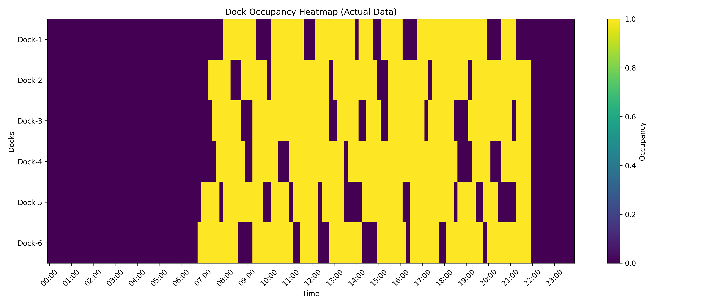
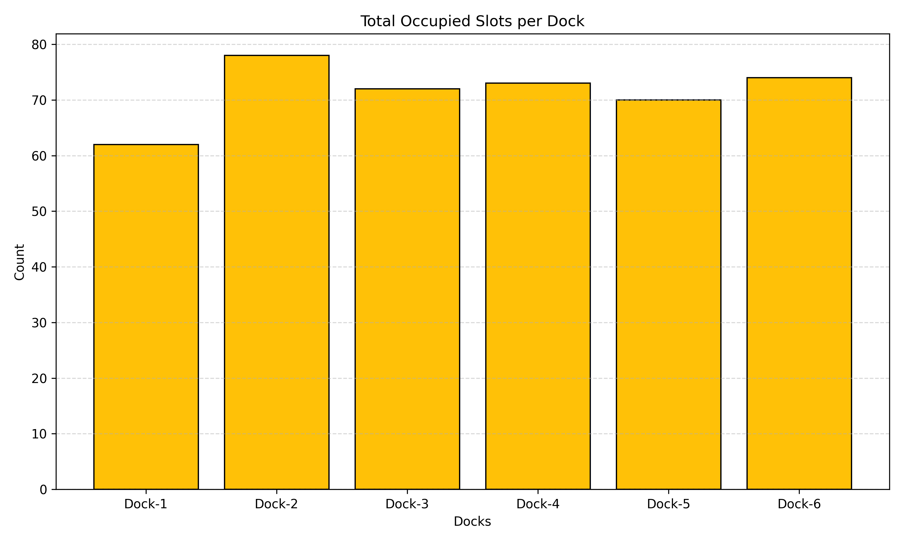
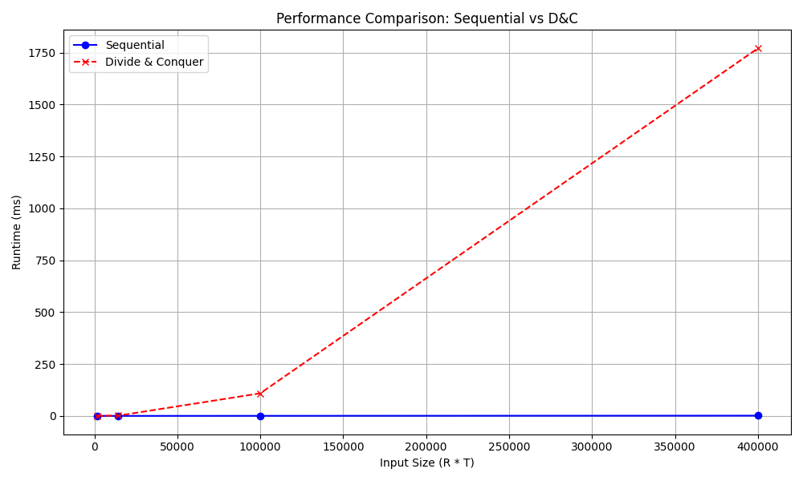

# Most Utilized Dock — Algorithm Analysis Project

This project analyzes dock utilization by constructing a binary occupancy matrix from raw event logs and identifying the **most utilized dock**.  
Two algorithmic approaches are implemented and compared:

- **Sequential Method (Role A)**
- **Divide & Conquer Method (Role B)**

The project includes data preprocessing, algorithm design, complexity analysis, timing experiments, and visualizations.

---

## 📚 Table of Contents

- [1. Problem Definition](#1-problem-definition)
- [2. Data Preparation (Role A)](#2-data-preparation-role-a)
- [3. Sequential Algorithm (Role A)](#3-sequential-algorithm-role-a)
- [4. Divide & Conquer Algorithm (Role B)](#4-divide--conquer-algorithm-role-b)
- [5. Complexity Analysis](#5-complexity-analysis)
- [6. Experiments & Results](#6-experiments--results)
- [7. Visualizations](#7-visualizations)
- [8. Project Structure](#8-project-structure)
- [9. Reproducibility Guide](#9-reproducibility-guide)
- [10. Testing](#10-testing)
- [11. Contributors](#11-contributors)

---

# 1. Problem Definition

We model dock usage using a **binary occupancy matrix**:


U in {0,1}^{R*T}


- **R** → number of docks  
- **T** → number of time slots  
- **U[i, t] = 1** → dock *i* is occupied at time *t*

🎯 **Goal:**  
Find the dock with the **maximum number of 1s**.  
If ties occur → choose **smaller row index**.

This problem appears in scheduling, transportation analytics, marina planning, and resource optimization.

---

# 2. Data Preparation (Role A)

Data preparation scripts:

src/create_data.py
src/setup_full_data.py


These scripts:

### ✔ Convert raw event logs into time-discretized intervals  
Each event has:

- `dock_id`
- `arrival_time`
- `departure_time`

We discretize the timeline using a fixed time step:

**Δ = 10 minutes**

### ✔ Build timestamp grid
From the earliest arrival → latest departure.

### ✔ Create occupancy matrix (U)
For each dock:


1. Find index interval using `np.searchsorted`
2. Mark occupied slots:

### ✔ Output files

Generated inside `data/`:

- **dock_occupancy_matrix.csv** → binary matrix  
- **dock_occupied_counts.csv** → row totals  
- **raw_logs.csv** → combined raw logs  
- **results.csv** → timing experiments

---

# 3. Sequential Algorithm (Role A)

File:

src/sequential.py

### ✔ Logic

For each row (i):

1. Count total `1`s  
2. Track current best  
3. If count > best → update  
4. If tie → keep smaller index  

### ✔ Correctness

- Scans 100% of matrix  
- Deterministic  
- Tie-breaking rule consistent with project requirements  

### ✔ Complexity

- **Time: Θ(RT)**  
- **Space: O(1)**  

Run:

bash
python src/sequential.py

-------------------------------------------------------------------------
4. Divide & Conquer Algorithm (Role B)

File:

src/divide_conquer.py


The D&C approach follows the assignment's required structure:

4.1 Recursive Row-Count Computation

Split matrix column-wise:

left  = U[:, :mid]
right = U[:, mid:]


Recursively compute counts for both halves:

                   C=Cleft+Cright

4.2 Recursive Tournament Argmax

Split vector into halves:
Find best index on left
Find best index on right

Compare

If tie → return smaller index

✔ Complexity

Work: Θ(RT)
Span: Θ(log T) (parallelizable)
Space: O(log T)

This matches the theoretical expectations from divide-and-conquer design.

5. Complexity Analysis

| Method               | Time  | Space    | Notes                                 |
| -------------------- | ----- | -------- | ------------------------------------- |
| **Sequential**       | Θ(RT) | O(1)     | Scans entire matrix                   |
| **Divide & Conquer** | Θ(RT) | O(log T) | Recursion overhead; parallel-friendly |

Key Insights

Both algorithms have same asymptotic work

Sequential outperforms D&C in Python due to:

Lower constant overhead

No recursion

D&C is conceptually better for parallel systems

## 6. Experiments & Results

**File:**  


src/run_experiment.py

This script performs the full timing-based comparison between the Sequential and Divide & Conquer algorithms.

### What the script does:

- Loads the occupancy matrix:  

data/dock_occupancy_matrix.csv


- Runs both algorithms **multiple times** (default N ≥ 10)
- Checks that both algorithms produce **identical results**
- Measures runtime using `time.perf_counter()`
- Saves all timing results into:  

data/results.csv

---

### Results include:

- **Runtime vs number of time slots (T)**
- **Runtime difference between Sequential vs D&C**
- **Verification that both algorithms agree**
- **Data for generating runtime scaling plots**

You can run the experiment with:

bash
python src/run_experiment.py


### Output Example

* Sequential: best_row = 3, count = 142
* Divide & Conquer: best_row = 3, count = 142
* OK — Both methods match.


7. Visualizations
File:

src/visualize_results.py
Generates:
Heatmap


Bar Chart


Runtime Scaling Plot


---------------------------------------------------
```
📦 MostUtilizedDock
├── data
│   ├── dock_events_raw_sample.csv
│   ├── dock_occupancy_matrix.csv
│   ├── dock_occupied_counts.csv
│   └── results.csv
│
├── figures
│   ├── bar_totals.png
│   ├── heatmap.png
│   └── runtime_analysis.png
│
├──  report
│   └── report
│
├──  src
│   ├── divide_conquer.py
│   ├── run_experiment.py
│   ├── sequential.py
│   ├── setup_full_data.py
│   ├── test_sequential.py
│   └── visualize_results.py
│
└──  README.md
└──  image-1.png
└──  image-2.png
└──  image-3.png
```

---------------------------------------------------
9. Reproducibility Guide
Step 1 — Generate data
python src/create_data.py
python src/setup_full_data.py

Step 2 — Run algorithms
python src/sequential.py
python src/divide_conquer.py

Step 3 — Run experiments
python src/run_experiment.py

Step 4 — Generate figures
python src/visualize_results.py

10. Testing
src/test_sequential.py
Run:
python src/test_sequential.py

Covers:
* correctness
* ties
* zero matrices
* simple known matrices
11. Contributors
| Role       | Member         | Responsibilities                                       |
| ---------- | -------------- | ------------------------------------------------------ |
| **Role A** | *Your Name*    | Data preparation, Sequential algorithm, Visualizations |
| **Role B** | *Partner Name* | D&C design, complexity analysis, experiments           |

License
This project is developed as part of Algorithm and Analysis coursework (HW2).